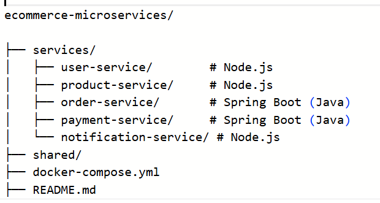

# E-commerce Microservices Backend (WIP)

This is a work-in-progress microservices-based backend for an e-commerce system, built using multiple technologies.

## 🎯 Goal

To build a real-world, scalable e-commerce backend using a **microservices architecture**, while learning and documenting:
- RESTful communication
- Asynchronous communication via Kafka
- Containerization using Docker
- Monorepo management

## 🧱 Tech Stack (Planned)

| Service | Language | Framework | Notes |
|---------|----------|-----------|-------|
| User Service | Node.js | Express | REST + MongoDB |
| Product Service | Node.js | Express | REST + MongoDB |
| Order Service | Java | Spring Boot | REST + Kafka |
| Payment Service | Java | Spring Boot | Kafka only |
| Notification Service | Node.js | Express | Kafka only |

## 📦 Repository Structure

